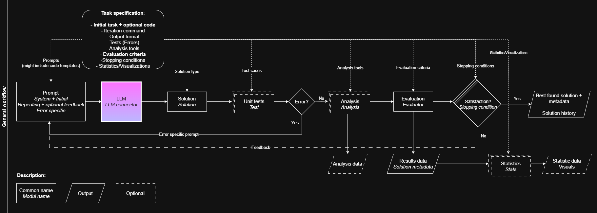

```
███████╗ █████╗ ███████╗███████╗
██╔════╝██╔══██╗██╔════╝██╔════╝
█████╗  ███████║███████╗█████╗  
██╔══╝  ██╔══██║╚════██║██╔══╝  
███████╗██║  ██║███████║███████╗
╚══════╝╚═╝  ╚═╝╚══════╝╚══════╝                    
```

<div align="center">
    
</div>

# 🎯 EASE - Effortless Algorithmic Solution Evolution

🚀 **Effortless Algorithmic Solution Evolution** is a framework that leverages Large Language Models (LLMs) to generate solutions (algorithms, text, images, etc.) based on user-defined parameters. It provides a flexible and adaptive approach to automated problem-solving.

### Version
0.2.0

### Disclaimer

This is an open beta version of the framework.

📄 Publication

The concepts and design of the EASE framework are described in detail in the following paper:

Solve it with EASE
- Adam Viktorin, Tomas Kadavy, Jozef Kovac, Michal Pluhacek, Roman Senkerik
- arXiv preprint, 2025
- [https://arxiv.org/abs/2509.18108](https://arxiv.org/abs/2509.18108)

If you use frontEASE or the EASE framework in your research, please consider citing this paper:

<details> <summary>BibTeX</summary>
@misc{viktorin2025solveease,
      title={Solve it with EASE}, 
      author={Adam Viktorin and Tomas Kadavy and Jozef Kovac and Michal Pluhacek and Roman Senkerik},
      year={2025},
      eprint={2509.18108},
      archivePrefix={arXiv},
      primaryClass={cs.LG},
      url={https://arxiv.org/abs/2509.18108}, 
}

</details>


## Features
- Utilizes LLMs to generate various types of solutions.
- Supports user-defined constraints and parameters.
- Extensible and modular architecture.
- Designed for research, prototyping, and practical applications.

## Project Structure

```
EASE/
│── dev.Dockerfile
│── Dockerfile
│── docker-compose.yml
│── docker-compose.override.yml
│── out_task/  # Directory for tasks created by EASE
│── requirements.txt
│── fastapi_main.py
│── fopimt/
```

## Docker Setup

This project uses Docker for containerization and includes separate configurations for development and production environments.

### Dockerfiles

- `Dockerfile`: Used for production. It sets up the required environment, installs dependencies, and runs the FastAPI application.
- `dev.Dockerfile`: Used for development. It includes additional configurations such as `--reload` for live reloading and excludes watching the `out_task` directory to prevent unnecessary restarts.

### Docker Compose

- `docker-compose.yml`: Defines the base service configuration, specifying how the application should be built and run using the production `Dockerfile`.
- `docker-compose.override.yml`: Overrides the base compose file for development. It ensures that the application is built using `dev.Dockerfile` instead.

## Running the Application

### Development Mode

To run the application in development mode with live reloading:

```sh
docker-compose up
```

This will use `docker-compose.override.yml` and build from `dev.Dockerfile`.

### Production Mode

To run the application in production mode:

```sh
docker-compose -f docker-compose.yml up -d
```

This runs the container in detached mode using `Dockerfile`.

## API Documentation

EASE provides a REST API for interacting with the framework. The documentation is available via OpenAPI:

```
http://localhost:8086/docs
```

## Frontend Implementation

For your convenience, we have also prepared a heavy-weight state aware frontend [frontEASE](https://github.com/TBU-AILab/frontEASE)

## Contributing

Before opening a pull request, format the code with Ruff using the settings from [pyproject.toml](pyproject.toml):

```sh
python -m pip install ruff
ruff format .
ruff check --fix .
```

These commands apply the repository formatting rules, including 88-character lines, double quotes, spaces for indentation, and import sorting.
## License

This work is licensed under a [Creative Commons Attribution 4.0 International License](https://creativecommons.org/licenses/by/4.0/).

## Contact

For inquiries, please contact [ailab@fai.utb.cz](mailto:ailab@fai.utb.cz).

