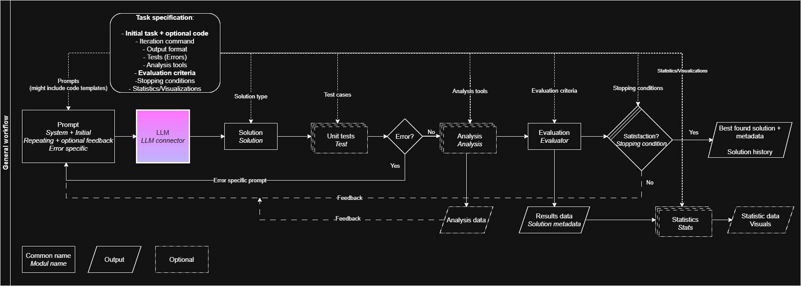

```
███████╗ █████╗ ███████╗███████╗
██╔════╝██╔══██╗██╔════╝██╔════╝
█████╗  ███████║███████╗█████╗  
██╔══╝  ██╔══██║╚════██║██╔══╝  
███████╗██║  ██║███████║███████╗
╚══════╝╚═╝  ╚═╝╚══════╝╚══════╝                    
```

<div align="center">
    
</div>

# 🎯 EASE - Effortless Algorithmic Solution Evolution

🚀 **Effortless Algorithmic Solution Evolution** is a framework that leverages Large Language Models (LLMs) to generate solutions (algorithms, text, images, etc.) based on user-defined parameters. It provides a flexible and adaptive approach to automated problem-solving.

### Version
0.1.0

### Disclaimer

This is an open beta version of the framework.

## Features
- Utilizes LLMs to generate various types of solutions.
- Supports user-defined constraints and parameters.
- Extensible and modular architecture.
- Designed for research, prototyping, and practical applications.

## Project Structure

```
EASE/
│── dev.Dockerfile
│── Dockerfile
│── docker-compose.yml
│── docker-compose.override.yml
│── out_task/  # Directory for tasks created by EASE
│── requirements.txt
│── fastapi_main.py
│── fopimt/
```

## Docker Setup

This project uses Docker for containerization and includes separate configurations for development and production environments.

### Dockerfiles

- `Dockerfile`: Used for production. It sets up the required environment, installs dependencies, and runs the FastAPI application.
- `dev.Dockerfile`: Used for development. It includes additional configurations such as `--reload` for live reloading and excludes watching the `out_task` directory to prevent unnecessary restarts.

### Docker Compose

- `docker-compose.yml`: Defines the base service configuration, specifying how the application should be built and run using the production `Dockerfile`.
- `docker-compose.override.yml`: Overrides the base compose file for development. It ensures that the application is built using `dev.Dockerfile` instead.

## Running the Application

### Development Mode

To run the application in development mode with live reloading:

```sh
docker-compose up
```

This will use `docker-compose.override.yml` and build from `dev.Dockerfile`.

### Production Mode

To run the application in production mode:

```sh
docker-compose -f docker-compose.yml up -d
```

This runs the container in detached mode using `Dockerfile`.

## API Documentation

EASE provides a REST API for interacting with the framework. The documentation is available via OpenAPI:

```
http://localhost:8086/docs
```

## Frontend Implementation

For your convenience, we have also prepared a heavy-weight state aware frontend [frontEASE](https://github.com/TBU-AILab/frontEASE)
<!--
## Contributing

Contributions are welcome! Please follow these steps:

1. Fork the repository.
2. Create a feature branch.
3. Commit your changes.
4. Submit a pull request.
-->
## License

This work is licensed under a [Creative Commons Attribution 4.0 International License](https://creativecommons.org/licenses/by/4.0/).

## Contact

For inquiries, please contact [ailab@fai.utb.cz](mailto:ailab@fai.utb.cz).

